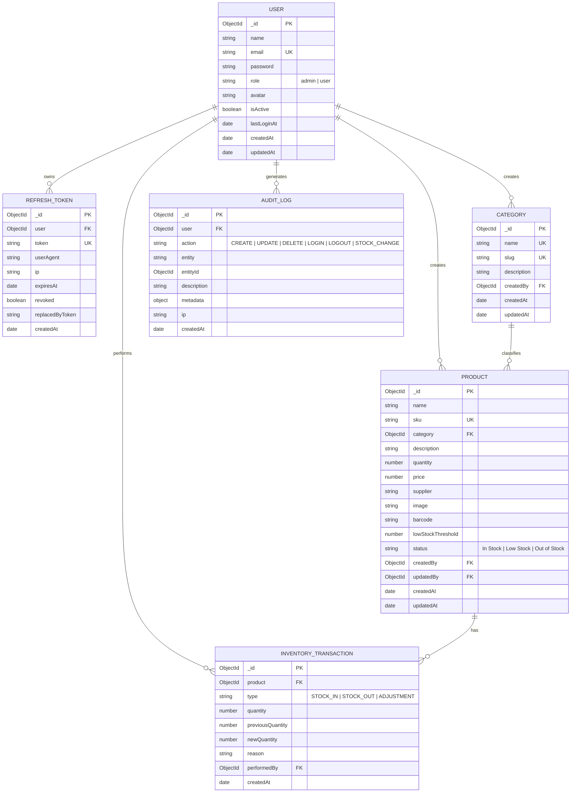

# Entity Relationship Diagram

## Notes

- **User → RefreshToken**: one-to-many. Each login/refresh issues a new rotating refresh token document; tokens are revoked on logout or rotation and auto-expire via a MongoDB TTL index on `expiresAt`.
- **Category → Product**: one-to-many. A category cannot be deleted while any product still references it.
- **Product → InventoryTransaction**: one-to-many, append-only ledger. `quantity` on `Product` is a derived, denormalized value kept in sync by `applyStockChange` (see `apps/server/src/services/inventory.service.js`); the transaction log is the source of truth for history.
- **AuditLog** references `User` and stores a free-form `entity`/`entityId` pointer so it can describe actions taken against Users, Categories, Products, or stock changes without needing a relation to every collection.
